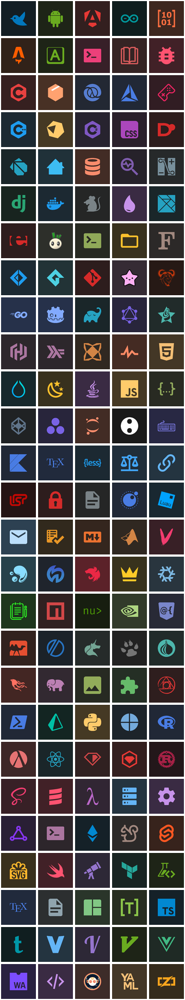
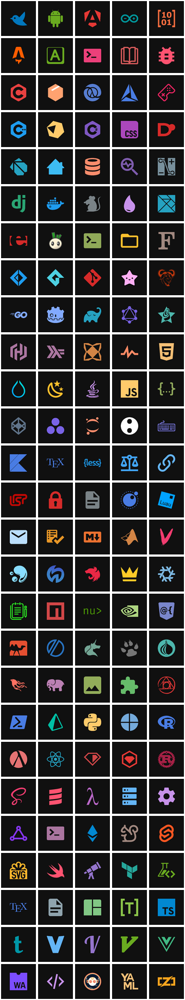
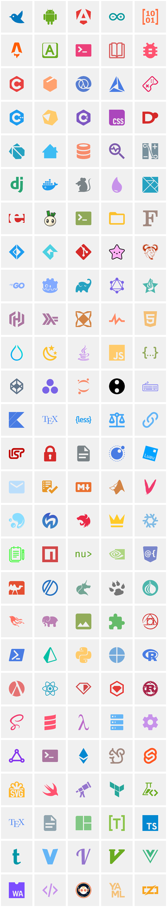
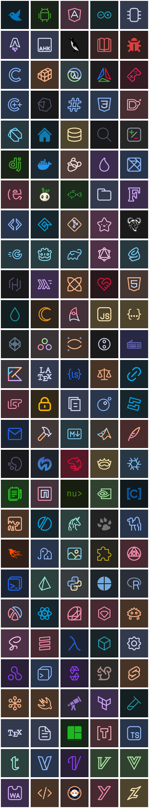
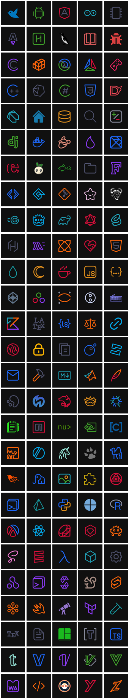
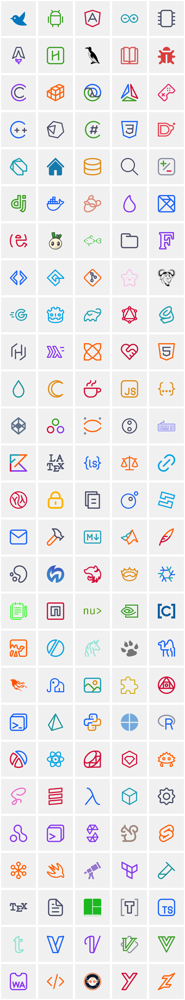
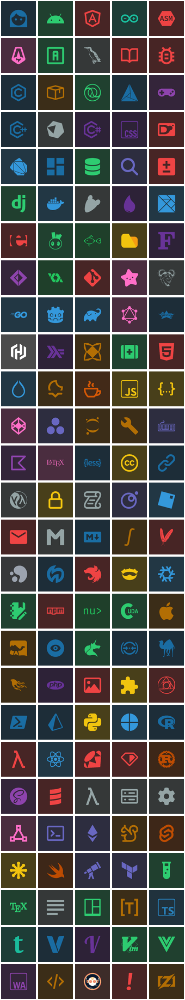
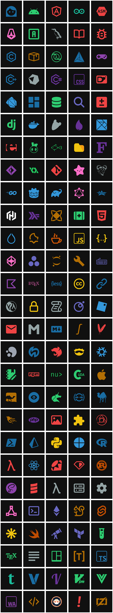
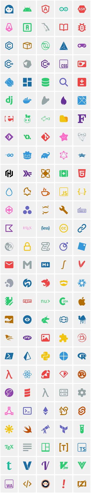

## Asset Repository  

This repository contains the assets currently used in my project, [cord.nvim](https://github.com/vyfor/cord.nvim). While I do not own the original icons, I have modified them to better fit the project's needs.  

## ⚖️ Licensing & Attribution  

- **Base Icons License**:  
  The original icons are sourced from third-party creators and are subject to their respective licenses. For more details, please refer to the [LICENSE.md](LICENSE.md) file located in the same directory.

- **Attribution**:  
  If you use any of the modified assets from this repository, you **must** provide attribution by linking either to this repository or my GitHub profile: 
  - Repository: [vyfor/icons](https://github.com/vyfor/icons)  
  - GitHub: [@vyfor](https://github.com/vyfor) 

If you have any questions regarding these assets or their licensing, feel free to reach out. 

## 🤝 Contributing  

These icons are generated using scripts that handle all necessary adjustments. If you'd like to request a new icon, please open an issue. PRs are unlikely to be considered. Although not necessary, providing an SVG version of the requested icon along with its licensing details would be greatly appreciated.

<!-- ICON_SHOWCASE -->

## Showcase
### Atom

Accent

Dark

Light

### Catppuccin

Accent

Dark

Light

### Default

Accent

Dark

Light

<!-- END_ICON_SHOWCASE -->
