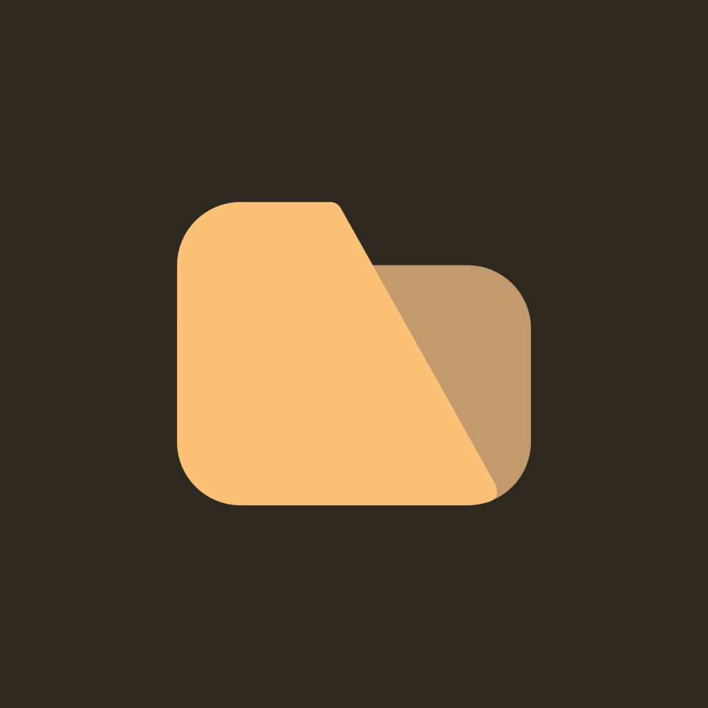
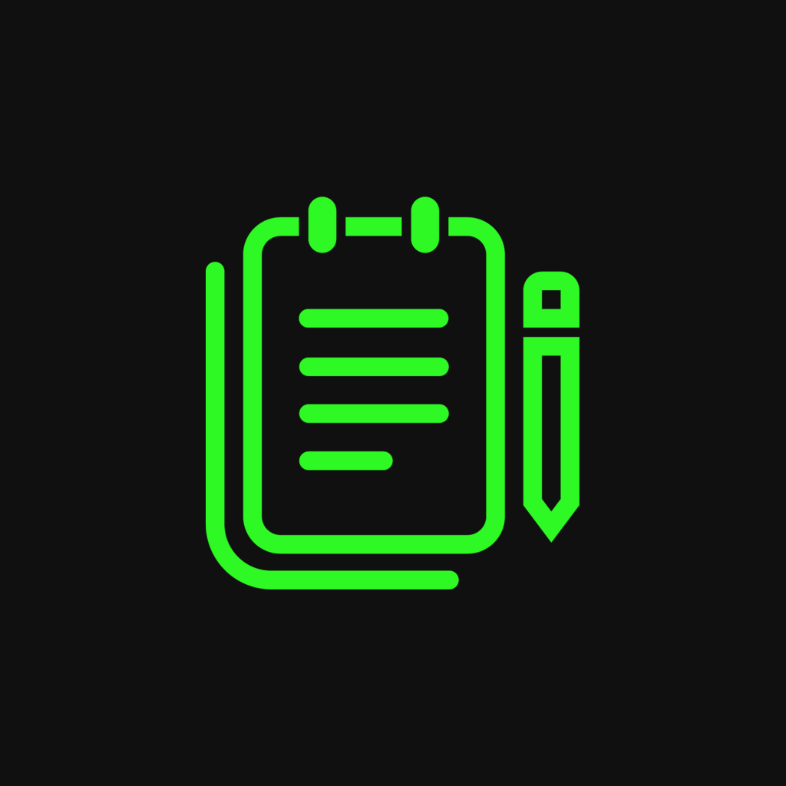
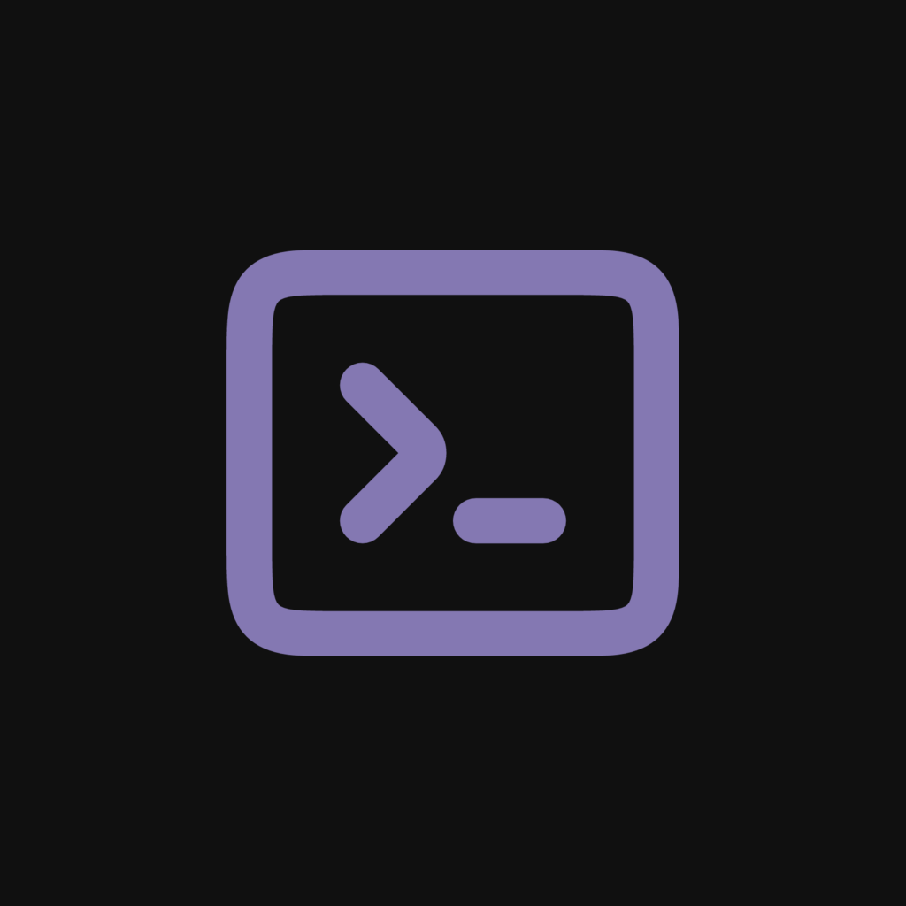
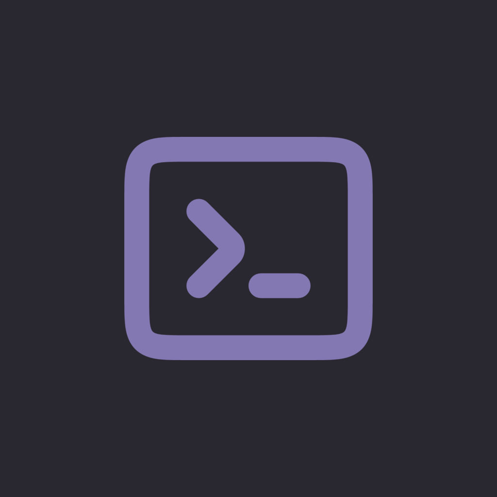
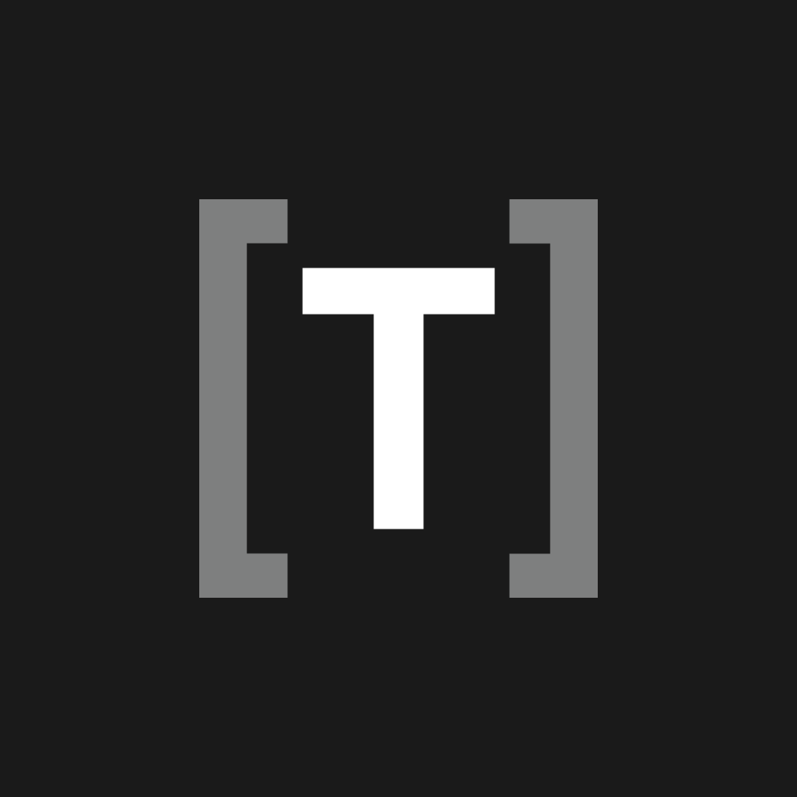

### Asset Repository

This repository contains the assets currently used in my project, [cord.nvim](https://github.com/vyfor/cord.nvim). While I do not own the original icons, I have made slight modifications to adapt them for use in the project.

#### Licensing Information:
- **Base Icons**:  
  The base icons are sourced from third-party creators and are subject to their respective licenses. For detailed information, please refer to the [LICENSE.md](LICENSE.md) file.
  
- **Modifications**:  
  The modifications to these assets are licensed under the same terms as the original assets. You must mention this repository when using any of my modified assets.

If you have any questions or inquiries regarding the these assets and their licensing, feel free to reach out.

Showcase

| Icon | onyx | pastel |
|------|---------|---------|
| ahk.png |  |  |
| assembly.png |  |  |
| astro.png |  |  |
| astronvim.png |  |  |
| book.png |  |  |
| c.png |  |  |
| cargo.png |  |  |
| clojure.png |  |  |
| cpp.png |  |  |
| crystal.png |  |  |
| csharp.png |  |  |
| css.png |  |  |
| d.png |  |  |
| dart.png |  |  |
| dashboard.png |  |  |
| docker.png |  |  |
| elixir.png |  |  |
| erlang.png |  |  |
| folder.png |  |  |
| fsharp.png |  |  |
| git.png |  |  |
| gml.png |  |  |
| go.png |  |  |
| gradle.png |  |  |
| groovy.png |  |  |
| haskell.png |  |  |
| haxe.png |  |  |
| html.png |  |  |
| idle.png |  |  |
| java.png |  |  |
| javascript.png |  |  |
| json.png |  |  |
| julia.png |  |  |
| keyboard.png |  |  |
| kotlin.png |  |  |
| latex.png |  |  |
| license.png |  |  |
| lisp.png |  |  |
| lsp.png |  |  |
| lua.png |  |  |
| lunarvim.png |  |  |
| markdown.png |  |  |
| maven.png |  |  |
| neorg.png |  |  |
| neovim.png |  |  |
| nim.png |  |  |
| nix.png |  |  |
| notes.png |  |  |
| nvchad.png |  |  |
| nvidia.png |  |  |
| ocaml.png |  |  |
| odin.png |  |  |
| org.png |  |  |
| pascal.png |  |  |
| perl.png |  |  |
| phoenix.png |  |  |
| php.png |  |  |
| plugin.png |  |  |
| postcss.png |  |  |
| powershell.png |  |  |
| python.png |  |  |
| quarto.png |  |  |
| r.png |  |  |
| react.png |  |  |
| ruby.png |  |  |
| rust.png |  |  |
| scala.png |  |  |
| scss.png |  |  |
| shell.png |  |  |
| sql.png |  |  |
| svelte.png |  |  |
| swift.png |  |  |
| telescope.png |  |  |
| text.png |  |  |
| toml.png |  |  |
| typescript.png |  |  |
| v.png |  |  |
| vim.png |  |  |
| viml.png |  |  |
| vue.png |  |  |
| xml.png |  |  |
| yaml.png |  |  |
| zig.png |  |  |

